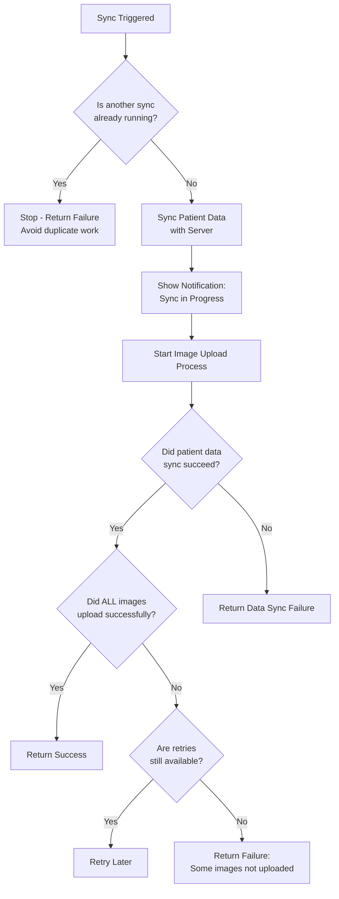
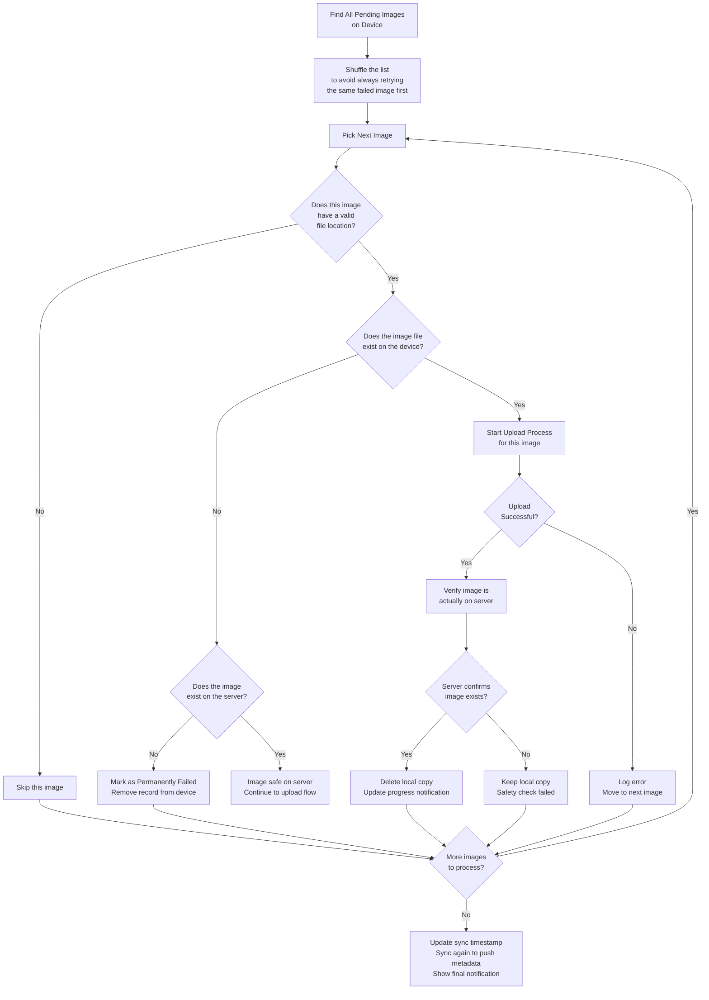
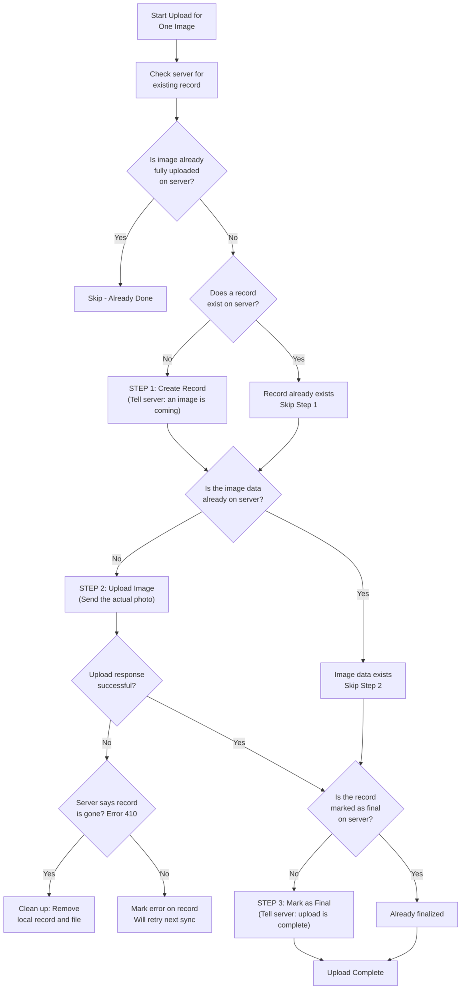

# AppSyncWorker - How Data Sync Works

This document explains how the app syncs patient data and uploads images to the server.

---

## Overview

When a sync is triggered, the app performs two main jobs:
1. **Sync patient data** (demographics, health records, etc.) with the server
2. **Upload any pending images** (e.g., photos attached to patient records)

---

## Main Sync Flow

---

## Image Upload Process (Per Image)

For each image found on the device, the app goes through this process:

---

## Three-Step Upload for Each Image

Each image upload follows a careful 3-step process to prevent data loss:

---

## What Happens in Each Scenario

### Scenario 1: Happy Path (Everything Works)
| Step | What Happens |
|------|-------------|
| 1 | Sync starts, patient data syncs successfully |
| 2 | App finds 3 pending images |
| 3 | For each image: creates server record, uploads photo, marks as complete |
| 4 | After each success: deletes local copy, updates notification (e.g., "2 images pending") |
| 5 | All done - notification shows "Upload successful" |

### Scenario 2: Internet Drops Mid-Upload
| Step | What Happens |
|------|-------------|
| 1 | First image uploads successfully |
| 2 | Internet drops during second image |
| 3 | Upload fails, error is logged |
| 4 | App checks if retries are available |
| 5 | If yes: sync will retry later and pick up where it left off |
| 6 | The 3-step process ensures no duplicate uploads on retry |

### Scenario 3: Image Deleted from Device Before Upload
| Step | What Happens |
|------|-------------|
| 1 | App finds a record for an image, but the photo file is missing |
| 2 | App checks if the image exists on the server |
| 3 | If server has it: no problem, continues normally |
| 4 | If server doesn't have it: marks as "permanently failed", removes the record |

### Scenario 4: Sync Already Running
| Step | What Happens |
|------|-------------|
| 1 | A sync is already in progress |
| 2 | Another sync is triggered (e.g., by schedule) |
| 3 | The new sync detects the lock and immediately stops |
| 4 | This prevents conflicts and duplicate uploads |

### Scenario 5: Server Already Has the Image
| Step | What Happens |
|------|-------------|
| 1 | App tries to upload an image |
| 2 | Checks server first and finds the image is already there and marked as complete |
| 3 | Skips the upload entirely |
| 4 | Safely deletes the local copy |

---

## Notifications

| State | Notification Shows |
|-------|-------------------|
| Sync starts | "Uploading images" with progress bar |
| During upload | "X images pending" with progress bar updating |
| All succeed | "Upload successful" |
| Some fail | "Upload failed" |

---

## Safety Measures

- **No duplicate work**: A lock prevents two syncs from running at the same time
- **No data loss**: After uploading, the app verifies the server actually received the image before deleting the local copy
- **Resumable**: The 3-step upload process means if a sync is interrupted, the next sync picks up from where it left off without re-uploading data
- **Shuffled order**: Images are processed in random order so one problematic image doesn't block others from being tried first
